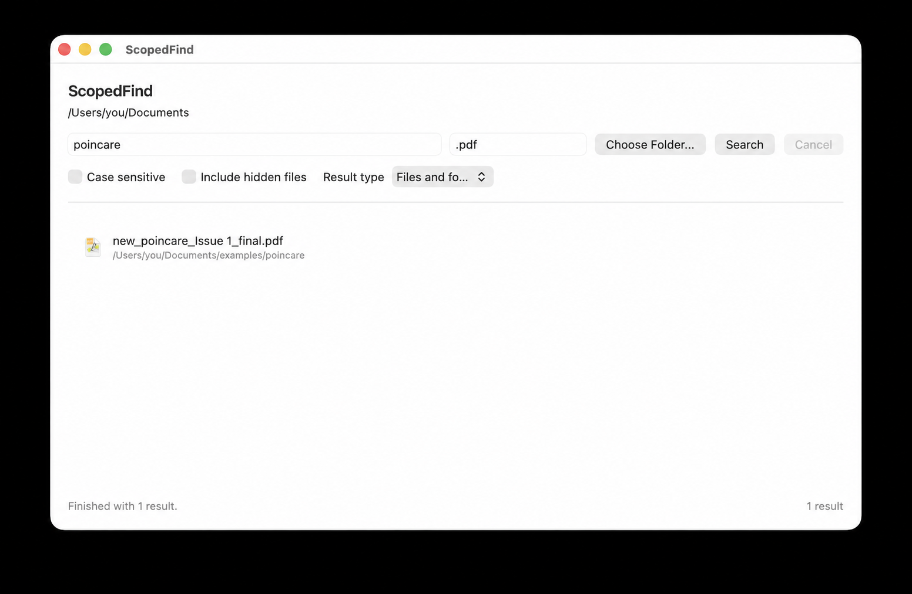

# ScopedFind

ScopedFind is a dependency-free native macOS app for searching inside one folder at a time. It has explicit Names and Contents modes, so filename matches do not get mixed with file-content matches.

It uses macOS's built-in `/usr/bin/find` and `/usr/bin/grep`, Apple's PDFKit, and an in-process DOCX ZIP/XML reader. It does not bundle search binaries, package-manager dependencies, telemetry, an updater, or a cloud service.



## Download

Download the latest DMG from the [Releases](https://github.com/dodoturkoz/ScopedFind/releases) page.

The release DMG is currently unsigned and not notarized. macOS may say the app is damaged or cannot be verified until you remove the download quarantine flag:

1. Open the DMG.
2. Drag `ScopedFind.app` onto the `Applications` shortcut in the DMG window.
3. Open Terminal.
4. Run:

    ```bash
    xattr -dr com.apple.quarantine /Applications/ScopedFind.app
    ```

5. Open `ScopedFind.app` normally from Applications.

Only run the quarantine-removal command for an app copy you trust. It bypasses macOS's download warning for that installed copy of ScopedFind.

## Features

- Dependency-free native SwiftUI app for scoped local search
- Separate Names and Contents modes
- Contents search for regular text files, text-based PDFs, and `.docx` files
- Extension filters such as `swift`, `.pdf`, `.docx`, or `jpg,png`
- Case-sensitive search, Unicode-aware fallback matching, hidden-file search, and fuzzy filename matching
- Streaming, cancellable results with Open, Reveal in Finder, and Copy Path actions

## Search Behavior

Searches are recursive and stay inside the folder you choose.

Names mode searches file and folder names with `/usr/bin/find`. By default it uses contains matching, so `report` matches names containing `report`. Fuzzy name matching can also match ordered characters, so `sf` can match `ScopedFind` and `rpt` can match `report-final.txt`. Fuzzy matching is only for file and folder names; it is not typo correction, ranked `fzf` search, or content search.

Contents mode searches regular files with `/usr/bin/grep`, text-based PDFs with PDFKit, and `.docx` Word document text with the in-process DOCX reader. The query is literal text, not a regular expression. Scanned or image-only PDFs are not OCRed, and legacy `.doc` files are not supported.

When Case sensitive is off, ScopedFind adds Unicode-aware, diacritic-insensitive fallback matching for names and supported file contents. For example, `sevket` can match `şevket`. Case-sensitive searches stay literal.

The Extensions field accepts extensions with or without a leading dot, separated by commas, semicolons, spaces, or newlines. In Names mode, you can search by extension only. In Contents mode, a text query is required.

## How It Searches

ScopedFind builds commands with `Process`, fixed executable paths, and argument arrays. It does not invoke `/bin/sh`, `/bin/zsh`, or any other shell.

Names mode is equivalent to:

```bash
/usr/bin/find "/selected/folder" -iname "*query*"
```

Contents mode uses `find` plus literal `grep` for regular files:

```bash
/usr/bin/find "/selected/folder" -type f -exec /usr/bin/grep -I -l --null -F -i -e "query" {} +
```

PDF and DOCX files are handled as dependency-free in-process passes after `find` enumerates matching files:

```bash
/usr/bin/find "/selected/folder" -type f -iname "*.pdf" -print0
/usr/bin/find "/selected/folder" -type f -iname "*.docx" -print0
```

If Extensions are empty, regular files, PDFs, and DOCX files are included. If Extensions are set, each pass only runs for matching extensions.

## Privacy

ScopedFind is intentionally local and transparent.

- It makes no network requests.
- It contains no analytics, telemetry, ads, crash-reporting SDK, tracking SDK, updater, launch agent, or background service.
- It does not request Full Disk Access.
- It searches only inside the folder you choose.
- Names mode does not read file contents.
- Contents mode reads file contents inside the chosen folder to find matching files.
- It does not log filenames or search queries.

The source code is public so you can inspect exactly how folder access and search execution work.

## Why Not Finder Search?

Finder and Spotlight are excellent for broad macOS search, but they often combine filename matches and file-content matches. ScopedFind is for narrower searches where the chosen folder and search mode should be explicit.

| Need | Finder search | ScopedFind |
| --- | --- | --- |
| Find by filename only | Can mix filename and content matches | Names mode searches names only |
| Search file text without Spotlight | Depends on indexing and metadata behavior | Uses `grep`, PDFKit, and the DOCX reader directly |
| Search exactly one chosen folder tree | Can be broad depending on scope | Stays inside the folder you choose |
| Filter by extension | Possible, but not always obvious | Dedicated Extensions field |
| Find apps in `/Applications` | Can be mixed with other result types | Use Names mode with `Files and folders` or `Folders/apps only` |

## Folder Access

ScopedFind uses the folder access granted by the native macOS folder picker for the current app session. The code is structured so security-scoped bookmarks can be added later if persistent access is needed.

## Building Locally

Open `ScopedFind.xcodeproj` in Xcode and run the `ScopedFind` scheme.

To build an app you can keep in Applications:

1. Open `ScopedFind.xcodeproj` in Xcode.
2. Select the `ScopedFind` scheme and `My Mac`.
3. Choose `Product > Build`.
4. Choose `Product > Show Build Folder in Finder`.
5. Open `Products/Debug` or `Products/Release`.
6. Drag `ScopedFind.app` into `/Applications`.

After that, you can launch ScopedFind from Applications, Spotlight, or your Dock without opening Xcode.

## Local Development

The repository includes a `Package.swift` test harness for non-UI logic:

```bash
swift test
```

A full app build needs Xcode, not only Command Line Tools.

## Project Scope

This is a personal, single-maintainer project published for source transparency. Issues are open for bug reports and small questions, but pull requests are intentionally disabled because the project is not intended to be community-maintained.

## License

MIT License. See `LICENSE`.
